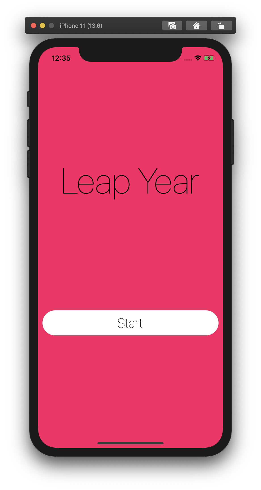
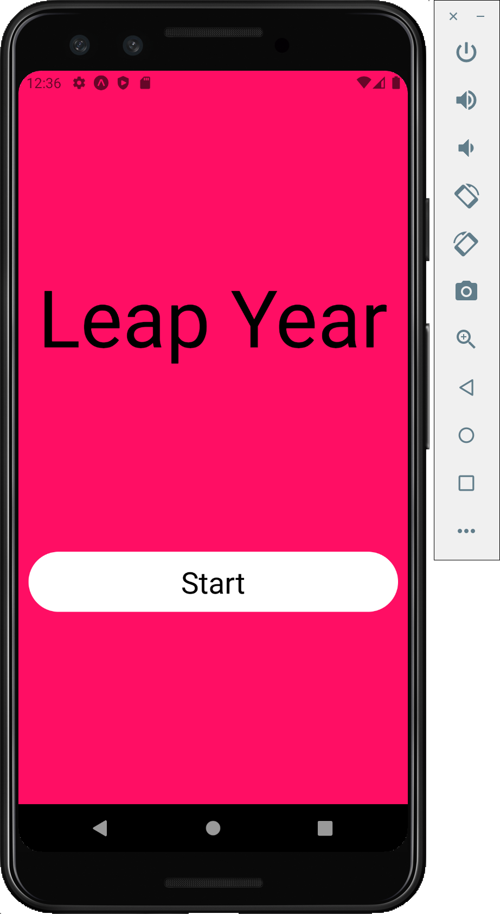

<p align="center">
  <a href="https://expo.dev/@andrusch/LeapYear">
    
  </a>
</p>

<h1 align="center">
  LeapYear App
</h1>

Tiny React Native App which displays whether the current year is a leap year.

<p align="center">
    
</p>

## Run on your phone

1. Go to [https://expo.dev/@andrusch/LeapYear](https://expo.dev/@andrusch/LeapYear)
2. Scan the QR Code with your phone. It might ask you to download the [Expo Go App](https://expo.dev/client).

## Development: Run app on local computer

Clone this repository, then

1. Install dependencies

    ```bash
      yarn
    ```

2. Run Expo development server

    ```bash
    yarn start
    ```

3. Open the Expo Go App on your device. Scan the QR code printed by expo start with Expo Client (Android) or Camera (iOS).

  You may have to wait a minute while your project bundles and loads for the first time.

## Educational purpose

This app is used as part of a React Native workshop to exercise the following concepts (among others):

- Styling
- Conditional rendering
- Unit Tests (TDD)
- Animations
- Text Input

## Screens

### Welcome Screen

This is how the welcome screen looks like on iOS and Android:

<p align="center">
    
    
</p>

### Home Screen

Enter a year as a 4-digit number. It will be displayed whether the entered year is a leap year.
